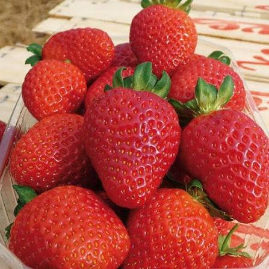

# Aplicación localizada de bajas dosis de biochar y condensado pirolítico para optimizar fertilización en fresa

*Fragaria × ananassa* Duchesne var. San Andrea

| **Código** | **Descripción** |
|:---:|:---|
| **FSA4** | **CAP-A foliar** |

| **Trat.** | **NPK** | **Biochar localizado** | **CAP-A foliar** | **Función experimental** |
|:---:|:---:|:---:|:---:|:---|
| **T4** | **80%** | **0** | **0.20%** | **Efecto individual CAP-A** |

